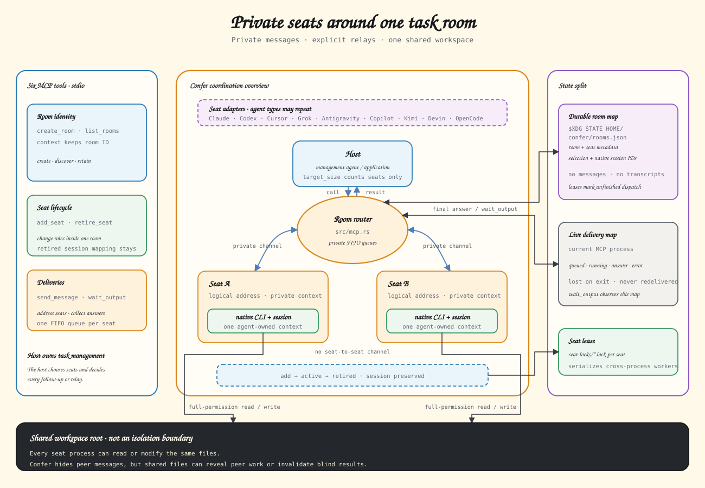

# Confer

Confer exposes local coding-agent execution through MCP. Coding agents and other applications can create rooms, send work to Claude Code, Codex, Cursor Agent, Grok Build, Antigravity CLI, GitHub Copilot CLI, Kimi Code, Devin for Terminal, and OpenCode, and collect their results.

The host manages tasks and relays; it is not an execution seat. Supply `target_size` for automatic seat selection, explicit `seats`, or both. There is no default count or fixed seat limit, and identical agent configurations can occupy independent seats.



Every supported agent uses a private per-seat FIFO queue. Idle seats start promptly, busy seats preserve message order, and different seats may run concurrently.

## Install

```bash
brew install samzong/tap/confer
```

The optional [duo](skills/duo/SKILL.md) Skill lets the host complete a task with one Confer partner chosen by task type and complexity; `confer skill install` does not install it, so first run `confer skill install` to install the confer Skill for that agent, then manually copy `skills/duo/` into the same skills root so its `../confer/SKILL.md` link resolves.
