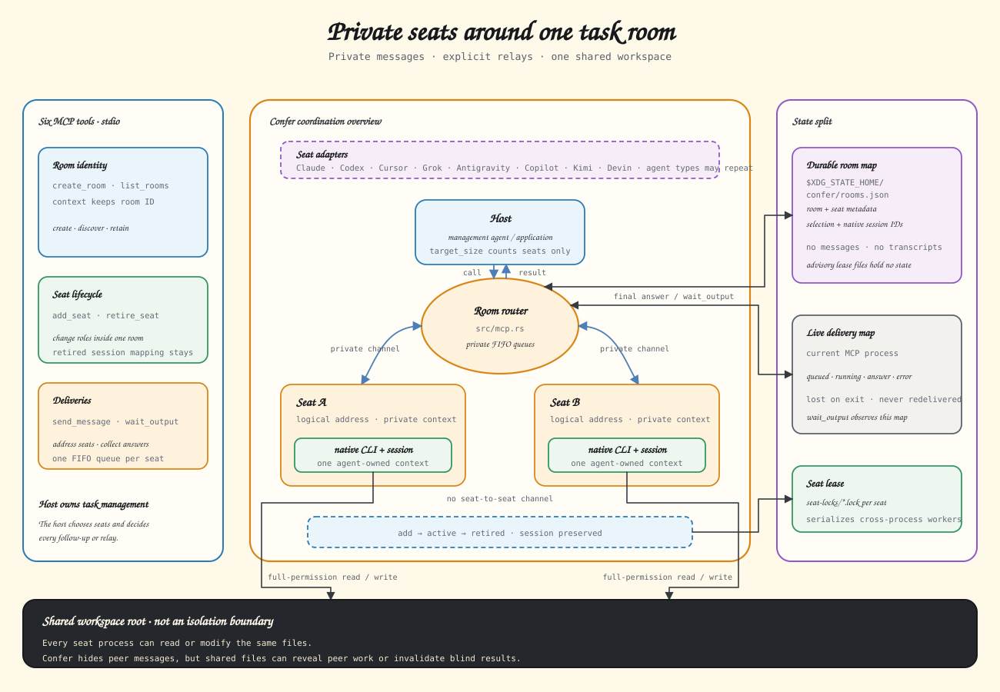

# Confer Design

## Product definition

Confer is a local MCP server that lets the current coding agent consult, coordinate, and resume other installed coding agents without copying text between terminal windows. It is a standalone Rust binary and has no dependency on Recall, Orca, or a daemon.



## Supported participants and hosts

The supported products can act as external room participants and as MCP hosts:

| ID | Product | Participant command | MCP registration |
| --- | --- | --- | --- |
| `claude` | Claude Code | `claude` | native `claude mcp` command |
| `codex` | Codex | `codex exec` | native `codex mcp` command |
| `cursor` | Cursor Agent | `agent` or `cursor-agent` | `~/.cursor/mcp.json` |
| `grok` | Grok Build | `grok` | native `grok mcp` command |
| `agy` | Antigravity CLI | `agy` | native `agy mcp` command |

MCP is the public protocol. Every seat uses an ACP v1 lifecycle internally. Cursor and Grok use native ACP over stdio; Codex uses an in-process ACP bridge to its app-server; Claude and Antigravity use in-process ACP bridges to their native headless commands. Confer ships one Rust binary and requires no separate bridge runtime.

## Room model

A room belongs to one normalized workspace. In a Git repository, the workspace is the canonical result of `git rev-parse --show-toplevel`. Different Git worktrees are different workspaces. Outside Git, the canonical current directory is the workspace.

The current MCP host is a room member and moderator. The default room size is three members including the current host, so the usual default is two external seats. At creation, `target_size` requests an initial total member count including the host. Explicit seats may increase that initial size, and `add_seat` may grow a room later. The same agent type may occupy multiple seats, with the same or different models.

A room is the task container for one initiating host session context. The host reuses a room only while its ID remains part of that current context. A new host session creates a new room even in the same workspace, and an explicit user request for a new room always creates one. Workspace matching never implies automatic reuse. Historical discovery happens only when the user explicitly asks to continue an earlier room.

Rooms may add seats as new roles become useful and retire seats whose role is complete. Retiring a seat preserves its metadata and native session mapping but permanently removes it from direct, multicast, and broadcast addressing.

Each external seat has these optional selection fields:

```json
{
  "agent": "codex",
  "model": "gpt-5.6-sol",
  "reasoning_effort": "high",
  "name": "planner",
  "instructions": "Design the change. Do not edit files."
}
```

`name` is a room address, not a built-in role. `instructions` are visible only to that seat. Every delivery includes those stable instructions and the current message, including when resuming a session whose first prompt failed. A recorded native session ID does not imply that instructions were delivered. Confer generates a unique seat name when none is supplied.

Rooms have no lifecycle status, automatic expiration, or garbage collection. A persisted room remains addressable by ID in its workspace. Starting a new room does not change or delete earlier rooms.

## Local state

Confer stores disposable room metadata and advisory seat lease files:

```text
~/.confer/rooms.json
~/.confer/seat-locks/*.lock
```

`rooms.json` contains a schema version and room records with:

- room ID, name, workspace root, and timestamps;
- originating host identity when known;
- external seat identity and selection fields;
- external seat active or retired status;
- native agent session ID and adapter recovery fields when a session has started.

These files do not contain message bodies, agent replies, pending delivery state, full transcripts, tool calls, thinking, or code snapshots. Seat lease files contain no semantic state. Native agent stores remain the source of truth for conversation history.

Room metadata writes use a short advisory lock and atomic replacement. Current writes use schema version 3; versions 1 and 2 remain readable and normalize on the next mutation, while unknown newer versions fail closed. Removing the disposable room cache resets Confer discovery without deleting native agent sessions.

## Readiness and selection

Readiness checks are local and run when a room is created, when a seat is added, and before each delivery starts. They inspect the executable and local authentication or configuration state without calling a model or checking quota. A positive result means `locally_ready`; it does not guarantee provider availability, model access, or remaining quota.

Creation and seat addition validate the final selected agent's deterministic configuration before saving any room change. Delivery uses the same validation. Malformed Cursor model options, conflicting option sources, and unsupported local effort values fail immediately. Model availability and provider-specific capabilities remain native runtime checks. Cursor accepts `reasoning_effort` without `model` and applies it to its configured default model; a default that does not support that effort returns a native error.

The current host, guided by the Skill, normally selects seat specifications from the task. Explicit user choices take precedence. When the host supplies no seats, Confer fills the requested size from locally ready supported agents.

If a requested participant is unavailable, Confer may replace it with another locally ready supported agent. The response must report the requested seat, replacement, and reason. A logical seat survives replacement and keeps its name and authorized room view. A replacement never receives another seat’s private messages or replies.

## Session lifecycle

`create_room` creates logical seats only. It performs no model call and does not start empty agent sessions.

The first queued message to an external seat creates its native session and records the native session ID. Every seat has one in-process FIFO worker. A sent message enters that worker, starts promptly when the seat is idle, and remains `queued` while an earlier delivery runs. Different seats may run concurrently. A cross-process file lease serializes workers from separate MCP processes, but FIFO ordering is guaranteed only within one live MCP process. Queue processing does not retry a native message after dispatch may have begun.

Delivery tracking, pending Queue messages, and workers exist only in the live MCP process. If that process exits, queued messages that have not started are lost, unfinished outputs and delivery IDs are lost, its lease is released, and native work may have continued. Persisted seat metadata keeps native session addressing, but not pending messages or in-flight certainty. The caller must verify uncertain native work before sending that seat another message. Confer never automatically redelivers an uncertain message because the first execution may have changed code.

## Message visibility

Each seat has a private native session, sees only addressed messages, and returns replies to the current host. Multicast and broadcast send independent copies to selected or all external seats; seats see neither the room transcript nor peer replies. Only the host can relay, so Confer never starts an unbounded agent-to-agent loop.

## MCP tools

The public MCP surface contains six tools.

### `create_room`

Creates a room for the current workspace.

Input:

- `name`: optional human-readable room name;
- `target_size`: optional total member count including the current host, default `3`;
- `host_agent`: optional current host ID when automatic detection is unavailable;
- `seats`: optional external seat specifications.

Output includes the room ID, normalized workspace, roster, readiness results, and any replacements. It never sends a task.

### `add_seat`

Adds one private seat to a room in the current workspace. The input uses the same agent, model, effort, name, and instruction fields as room creation. Existing and retired seat names remain reserved. Output includes the updated room, readiness results, and any replacement.

### `retire_seat`

Retires one seat by name or ID in a room in the current workspace. A busy seat returns `seat_busy`. Retirement preserves the native session mapping but is irreversible.

### `list_rooms`

Lists rooms. `scope` defaults to `current`; `all` returns metadata for every recorded workspace. The host calls this only when the user explicitly asks to recover an earlier room. Discovery does not allow `send_message`, `add_seat`, or `retire_seat` to cross workspace boundaries.

Output includes room ID, name, participants, native-session availability, and timestamps. It never returns message content.

### `send_message`

Sends one message to one seat, selected seats, or all external seats.

Input:

- `room_id`;
- `recipients`: one or more seat names or IDs, or `*` for broadcast;
- `message`.

The send returns one receipt and new `delivery_id` per recipient plus immediate acceptance or readiness errors. The receipt does not include delivery status; the caller uses `wait_output` to observe `queued`, `running`, `completed`, or `failed` state.

### `wait_output`

Waits for specified deliveries or the room’s current live deliveries. `timeout_ms` defaults to `120000`, accepts `0` for an immediate snapshot, and is capped at `600000`.

Output contains each delivery’s `queued`, `running`, `completed`, or `failed` status, final assistant answer, and error. It does not expose thinking, token deltas, or intermediate tool events. A timeout returns completed results and current non-terminal statuses without cancelling them.

## CLI surface

The CLI exists to serve and install the MCP and bundled Skill:

```text
confer mcp
confer mcp capabilities
confer mcp install [--agent <id>]... [--dry-run] [--bin <path>]
confer mcp uninstall [--agent <id>]... [--dry-run]
confer skill install [--scope user|project] [--agent <id>]... [--dry-run] [--yes]
```

`confer mcp` serves stdio MCP. Room operations are not exposed as ordinary CLI commands.

MCP and Skill installation are deliberately independent. `confer mcp install` never installs the Skill, and `confer skill install` never changes MCP configuration. Both installation commands support Claude Code, Codex, Cursor, Grok, and Antigravity CLI.

`confer skill install` embeds the [canonical Skill](../skills/confer/SKILL.md) and delegates target paths, conflict protection, updates, scope, and dry-run reporting to Kitup. User scope is the default.

`confer mcp install` follows each host’s supported registration mechanism. Repeated installation updates the Confer-owned registration without deleting unrelated MCP entries. Uninstall removes only the `confer` entry.

## Adapter contract

Every adapter must:

- resolve its supported executable without scanning unrelated agents;
- perform a local readiness check without a model call;
- create a native session on first send and capture its stable ID;
- resume exactly that session for later messages;
- pass the selected model and reasoning effort when supported;
- run in the room’s stored workspace root;
- extract the final assistant answer from machine-readable output;
- preserve stderr for actionable errors without leaking credentials, and return native failures without retry or fallback.

Confer owns the FIFO Queue above every adapter. Each queued delivery opens one ACP connection, runs one native agent process, and resumes the seat's recorded native session when one exists. Session history replay is excluded from the current answer. After a terminal response, Confer closes the connection and reaps its child; a child that remains alive after three seconds is terminated. There is no idle process pool.

Cursor seats use its ACP session store. Old headless Cursor session IDs are not migrated and require new seats. Other native session stores are not rewritten. An observed session ID remains available when the prompt fails; a missing or stale ID never triggers silent replacement.

Model and reasoning fields are requests to the native CLI. An unsupported value must produce a clear adapter error rather than silently selecting another model.

## Permissions and filesystem

Confer uses the room workspace as each child process working directory. It does not create filesystem isolation. Independent seats may therefore read or modify the same files even when their messages are isolated.

Confer launches every seat with that agent's full-permission setting so a non-interactive process is never blocked on an approval prompt it cannot answer: Claude and Antigravity receive `--dangerously-skip-permissions`; Codex receives app-server `approvalPolicy: never` and the full-access sandbox policy; Cursor receives `--trust --force`; and Grok receives `--always-approve` and ACP `yoloMode`. Seats therefore run with the same authority as the current host and without sandbox isolation. Explicit task instructions remain the only limit on what a seat is asked to do.

## Errors

Tool errors must identify the room, seat, agent, and failing operation when those values exist. Expected error classes include:

- unsupported or locally unavailable agent;
- missing or stale native session;
- invalid room for the current workspace;
- duplicate or unknown seat address;
- native CLI launch, parse, authentication, model, permission, or concurrency failure;
- unknown or expired in-memory delivery ID;
- timeout with partial results.

Confer must not reinterpret a failed send as success, silently create a replacement session for a stale native session, or retry a message that may have executed.
